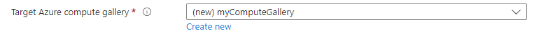

# Creating Custom VM Images with Azure VM Image Builder (Portal Integration)

In this article, we will explore the process of creating custom virtual machine (VM) images using Azure VM Image Builder through the Azure Portal.

Dev boxes with built-in VM images from the marketplace are convenient and easy to use. However, in a more realistic scenario, your organization may need to use customized VM images. These images may vary for each team in the organization, depending on the specific software and tools they need as a minimum requirement. When you create the dev box pools, you can choose whether to grant the developers “local admin” privileges or not, allowing them to install additional software in the dev box. Regardless of the local admin option, it is a great time saver for a new developer to join a new project or a task and have all the necessary software and tools pre-installed in the dev box image. To achieve this, you have the following options:

1. Manually provision and customize a VM
2. Use Azure Image Builder with ARM templates (follow [these steps](how-to-customize-devbox-azure-image-builder.md) to learn more)
3. Use Azure Image Builder with Portal Integration (Image Templates) - this is the topic of this article

## Prerequisites

To provision a custom image that you created by using VM Image Builder through the Portal, you need:

- Owner or Contributor permissions on an Azure subscription or on a specific resource group.
- A resource group.

# Core Concepts

Before we dive into the step by step guide on how to use Image Templates, let's look at some of the core concepts.

## Azure VM Image Builder for Microsoft Dev Boxes

**Azure VM Image Builder** is a powerful tool designed to streamline the process of creating custom virtual machine (VM) images, specifically optimized for development environments. Here's how it benefits Microsoft Dev Boxes:

* Azure Image Builder simplifies the creation of VM images. It enables you to create standardized images that include predefined security, configuration settings, and any necessary software for your dev boxes.
* It eliminates the need for complex tooling, processes, and manual steps to create a VM image.
* You can add any customizations you want for the image. It allows you to customize your images according to the specific needs of each team in your organization, by using existing scripts, commands, and processes to integrate your core applications into the images.
* It integrates natively with Azure Compute Gallery, which provides an image management system for distributing, replicating, versioning, and scaling images globally.
* It reduces the complexity and time required to create and distribute your images, by abstracting out the details and hiding Azure-specific requirements, such as the need to generalize the image (Sysprep).

## **Azure Image Templates: Enhancing the Experience**

When combined with **Azure Image Templates** (Portal Integration), VM Image Builder becomes even more potent for Microsoft Dev Boxes:

1. **Portal Integration**:
   - **New Portal Functionality**: Access Azure Image Builder directly from the Azure portal.
   - **Create and Validate Images**: Build and validate custom images within the portal itself.

2. **Tailored Image Templates**:
   - **Dev Box-Specific Templates**: Craft image templates optimized for Microsoft Dev Boxes.
   - **Accelerate Development**: Quickly spin up Dev Boxes with pre-configured tools and settings.

In summary, Azure VM Image Builder simplifies image creation, ensures consistency, and seamlessly integrates with Azure Image Templates, making it an ideal choice for building efficient and standardized Microsoft Dev Boxes.


## **Image Source**
- An **image source** is a resource used to create an **image version** within an Azure Compute Gallery.
- It can be:
  - An existing **Azure VM** (either generalized or specialized).
  - A **managed image**.
  - A **snapshot**.
  - An **image version** from another gallery.

## **Compute Gallery**
- The **Azure Compute Gallery**, formerly known as the **Shared Image Gallery**, simplifies sharing custom images across your organization.
- Key features:
  - **Global Replication**: Images can be replicated to multiple regions for quicker scaling of deployments.
  - **Versioning and Grouping**: Organize resources for easier management.
  - **High Availability**: Supports Zone Redundant Storage (ZRS) accounts in regions with Availability Zones.
  - **Sharing Options**: Share resources within your organization, across regions, or publicly using a community gallery.

## **Image Definition**
- **Image definitions** are created within a gallery.
- They carry information about the image requirements for internal use.
- Includes details like whether the image is for Windows or Linux, release notes, and minimum/maximum memory requirements.

## **Image Version**
- An **image version** is used to create a VM when using a gallery.
- You can have multiple versions of an image as needed for your environment.
- When creating a VM using an image version, it's used to create new disks for the VM.
- Image versions can be reused.


----

# Step-by-Step guide

This guide will walk you through how to create custom VM images using Azure VM Image Builder through the Azure Portal. Another way to do this is via ARM templates as described [here](https://learn.microsoft.com/en-us/azure/dev-box/how-to-customize-devbox-azure-image-builder).

## Step 0 - Create a new RG & Dev Center

* Create a new Resource Group
  * Create a new Dev Center

## Step 1 - Check your provider registrations

To use VM Image Builder, you need to register the features.

Check your provider registrations. Make sure each command returns Registered for the specified feature.


    Get-AzResourceProvider -ProviderNamespace Microsoft.VirtualMachineImages | Format-table -Property ResourceTypes,RegistrationState 
    Get-AzResourceProvider -ProviderNamespace Microsoft.Storage | Format-table -Property ResourceTypes,RegistrationState  
    Get-AzResourceProvider -ProviderNamespace Microsoft.Compute | Format-table -Property ResourceTypes,RegistrationState 
    Get-AzResourceProvider -ProviderNamespace Microsoft.KeyVault | Format-table -Property ResourceTypes,RegistrationState 
    Get-AzResourceProvider -ProviderNamespace Microsoft.Network | Format-table -Property ResourceTypes,RegistrationState

If the provider registrations don't return `Registered`, register the providers by running the following commands:

    Register-AzResourceProvider -ProviderNamespace Microsoft.VirtualMachineImages  
    Register-AzResourceProvider -ProviderNamespace Microsoft.Storage  
    Register-AzResourceProvider -ProviderNamespace Microsoft.Compute  
    Register-AzResourceProvider -ProviderNamespace Microsoft.KeyVault  
    Register-AzResourceProvider -ProviderNamespace Microsoft.Network

## Step 2 - Create a Managed Identity

This step creates a user-assigned identity with a custom role definition and set permissions on the resource group.

* Open the `Cloud Shell` on the Azure Portal
* Select `PowerShell`
* Create a new file in the current (or desired) directory. You can use `nano base.ps1`
* Copy and paste the following code and edit the values for **Resource Group**, **Location** and **identityName**.

```
# Install PowerShell modules:

'Az.ImageBuilder', 'Az.ManagedServiceIdentity' | ForEach-Object {Install-Module -Name $_ -AllowPrerelease}

<#
Create variables to store information that you use more than once.

Copy the following sample code.
Replace <Resource group> with the resource group that you used to create the dev center.
Run the updated code in PowerShell.
#>

# Get existing context 
$currentAzContext = Get-AzContext

# Get your current subscription ID  
$subscriptionID=$currentAzContext.Subscription.Id

# Destination image resource group  
$imageResourceGroup="<ENTER RESOURCE GROUP NAME>"

# Location  
$location="westeurope"

# Create a user-assigned identity and set permissions on the resource group by running the following code in PowerShell.

# VM Image Builder uses the provided user identity to inject the image into Azure Compute Gallery. The following example creates an Azure role definition with specific actions for distributing the image. The role definition is then assigned to the user identity.

# Set up role definition names, which need to be unique 
$timeInt=$(get-date -UFormat "%s") 
$imageRoleDefName="Azure Image Builder Image Def"+$timeInt 
$identityName="myUID"+$timeInt 

# Add an Azure PowerShell module to support AzUserAssignedIdentity 
Install-Module -Name Az.ManagedServiceIdentity 

# Create an identity 
New-AzUserAssignedIdentity -ResourceGroupName $imageResourceGroup -Name $identityName -Location $location

$identityNameResourceId=$(Get-AzUserAssignedIdentity -ResourceGroupName $imageResourceGroup -Name $identityName).Id 
$identityNamePrincipalId=$(Get-AzUserAssignedIdentity -ResourceGroupName $imageResourceGroup -Name $identityName).PrincipalId

# Assign permissions for the identity to distribute the images.
# Use this command to download an Azure role definition template, and then update it with the previously specified parameters:

$aibRoleImageCreationUrl="https://raw.githubusercontent.com/azure/azvmimagebuilder/master/solutions/12_Creating_AIB_Security_Roles/aibRoleImageCreation.json" 
$aibRoleImageCreationPath = "aibRoleImageCreation.json" 

# Download the configuration 
Invoke-WebRequest -Uri $aibRoleImageCreationUrl -OutFile $aibRoleImageCreationPath -UseBasicParsing 
((Get-Content -path $aibRoleImageCreationPath -Raw) -replace '<subscriptionID>',$subscriptionID) | Set-Content -Path $aibRoleImageCreationPath 
((Get-Content -path $aibRoleImageCreationPath -Raw) -replace '<rgName>', $imageResourceGroup) | Set-Content -Path $aibRoleImageCreationPath 
((Get-Content -path $aibRoleImageCreationPath -Raw) -replace 'Azure Image Builder Service Image Creation Role', $imageRoleDefName) | Set-Content -Path $aibRoleImageCreationPath 

# Create a role definition 
New-AzRoleDefinition -InputFile  ./aibRoleImageCreation.json

# Grant the role definition to the VM Image Builder service principal 
New-AzRoleAssignment -ObjectId $identityNamePrincipalId -RoleDefinitionName $imageRoleDefName -Scope "/subscriptions/$subscriptionID/resourceGroups/$imageResourceGroup"

```
* If you are using **Nano** editor, then **Write Out** and **Exit**
* Click on `{}` (*Open Editor*) to see the created file with the code in it.
* Run the PowerShell script `./base.ps1`
* Note the name of the managed identity you just created which will be shown in the output.
* You can choose to delete the file `base.ps1` now or after finishing this tutorial.

> VM Image Builder uses the provided user identity to inject the image into Azure Compute Gallery. The included script creates an Azure role definition with specific actions for distributing the image. The role definition is then assigned to the user identity.

The Managed Identity will have the following permissions:


```
You may need to add Additional permissions on the managed identity. If you get a "LinkedAuthorizationFailed" error, then it could be because your service principal does not have the required permissions to assign a user-assigned identity to a virtual machine. To fix this issue, you need to grant the service principal the role of Managed Identity Operator on the user-assigned identity resource. You can do this by following these steps:
* Navigate to the Azure portal and sign in with your account.
* Search for User-assigned identities in the search box and select the service from the results.
* Select the user-assigned identity that is mentioned in the error message.
* Click on Access control (IAM) from the left menu.
* Click on Add and select Add role assignment from the drop-down menu.
* In the Add role assignment pane, select Managed Identity Operator as the role, and search for the service principal that is mentioned in the error message (the Managed Identity).
* Select the service principal from the results and click Save.
```

## Step 3 - Create Image Template

On the Azure Portal > Create an `Image Templates` resource. 

Under the **Basics** tab, enter the required information following the below guide.
|Parameter|Value/Description|
|-|-|
|Project details > **Resource Group**|As a prerequisite for this tutorial, you should have already created a Resource Group. If not, you can create it first before creating a new Image Templates resource.|
|Instance details > **Source Image**|Select **Marketplace**|
|Instance details > **Image**| Click on **See all images** <br><br> Search for **dev box** and select any image which says **Microsoft Dev Box compatible**). See below for an example.<br><br> <br><br> <br><br> Check the [Compute gallery image requirements](https://learn.microsoft.com/en-us/azure/dev-box/how-to-configure-azure-compute-gallery#compute-gallery-image-requirements) for more details on things to consider when choosing a base image.|
|Distribution targets| Choose **VM image version** as we will distribute the image version to the Azure Compute Gallery<br><br>|
|Target Azure Compute Gallery|Create a new one from here by giving a new name for the Compute Gallery resource<br>|
|Target VM image definition|Create a new VM image definition. <br><br> <br><br> You should select the Security type as **Trusted launch** and give a name to the other attributes. Check the [terminology guide](https://learn.microsoft.com/en-us/azure/virtual-machines/windows/cli-ps-findimage#terminology) for more details on image attributes.|
|Version number|Give an image version in the Format: MajorVersion.MinorVersion.Patch. For example: **0.0.1**|
|Managed Identity| Select the Managed Identity we created in the previous step, earlier in this tutorial. Note - If you face issues seeing the managed identity from the Image Template resource, try to create the Image Template resource on `preview.portal.azure.com`|

Click on **Next:Customizations** to add the required customizations on top of the chosen base VM image. Keep the following in mind.

|Parameter|Value/Description|
|-|-|
|Virtual network|You can keep the default value of **Auto-generate virtual network**. Please note that when you do not specify any particular VNET, then Azure Image Builder will create its own VNET, Public IP, and NSG. The Public IP is used for the service to communicate with the build VM, however if you do not want a Public IP or want Azure Image Builder to have access to your existing VNET resources, such as configuration servers (DSC, Chef, Puppet, Ansible), file shares etc., then you can specify a VNET. Only virtual networks in the current region will be listed.|
|Managed identity|You can use the Managed Identity created earlier or better yet, create a new Managed Identity and give it |

* Go to the Customizations page next and under **Customize with scripts** > ADD > `PowerShell Command`
* Add the following PowerShell commands. Repeat the previous step after every **PowerShell command** added. For each customization below, Give **Permissions = Elevated**.
 #### Chocolatey Package Manager
 ```
 Set-ExecutionPolicy Bypass -Scope Process -Force; [System.Net.ServicePointManager]::SecurityProtocol = [System.Net.ServicePointManager]::SecurityProtocol -bor 3072; iex ((New-Object System.Net.WebClient).DownloadString('https://community.chocolatey.org/install.ps1'))
 ```
 #### Postman

    choco install -y postman

[Postman chocolatey package](https://community.chocolatey.org/packages/postman)

#### SoapUI

    choco install -y soapui

[SoapUI chocolatey package](https://community.chocolatey.org/packages/soapui)

#### VS Code
    choco install -y vscode
    
[Visual Studio Code chocolatey package](https://community.chocolatey.org/packages/vscode)

#### Eclipse

    choco install -y eclipse

[Eclipse chocolatey package](https://community.chocolatey.org/packages/eclipse)

After adding the above required packages, continue with the following steps.

* Select **Review + Create** and then create the resource
* After the Image Template gets created, go to the next step **Start Build**

## Step 4 - Start build

In the created Image Template, click on `Start Build`.

You can `Refresh` the status and wait until the `Build run state` shows complete. This step will take some time to complete as it builds a version of the image from the template.

Wait for the build to complete before moving to the next steps.

## Step 5 - Add the Compute Gallery to the Dev Center

[Source](https://learn.microsoft.com/en-us/azure/dev-box/how-to-configure-azure-compute-gallery#provide-permissions-for-services-to-access-a-gallery)

Galleries cannot be added until an identity has been assigned to the Dev Center.

> When you use an Azure Compute Gallery image to create a dev box definition, the Windows 365 service validates the image to ensure that it meets the requirements to be provisioned for a dev box. Microsoft Dev Box replicates the image to the regions specified in the attached network connections, so the images are present in the region required for dev box creation.
> To allow the services to perform these actions, you must provide permissions to your gallery as follows.

* Create a new User Managed Identity
* Add a User Managed Identity to the Dev Center
  * In the Settings blader of the Dev Center resource, go to `Identity`> `User assigned` and add a user assigned managed identity.
* Attach the gallery to the dev center


> Microsoft Dev Box behaves differently depending how you attach your gallery:
> * When you use the Azure portal to attach the gallery to your dev center, the Dev Box service creates the necessary role assignments automatically after you attach the gallery. This is the option chosen for this PoC.
> * When you use the Azure CLI to attach the gallery to your dev center, you must manually create the Windows 365 service principal and the dev center's managed identity role assignments before you attach the gallery. More details [here](https://learn.microsoft.com/en-us/azure/dev-box/how-to-configure-azure-compute-gallery#assign-roles).

## Step 6 - Create the Dev Box Definition & Project

* Create a Dev Box definition with the new Image.
* Create a new Project
* Create a new Dev Box Pool
* Assign the project to the developer persona